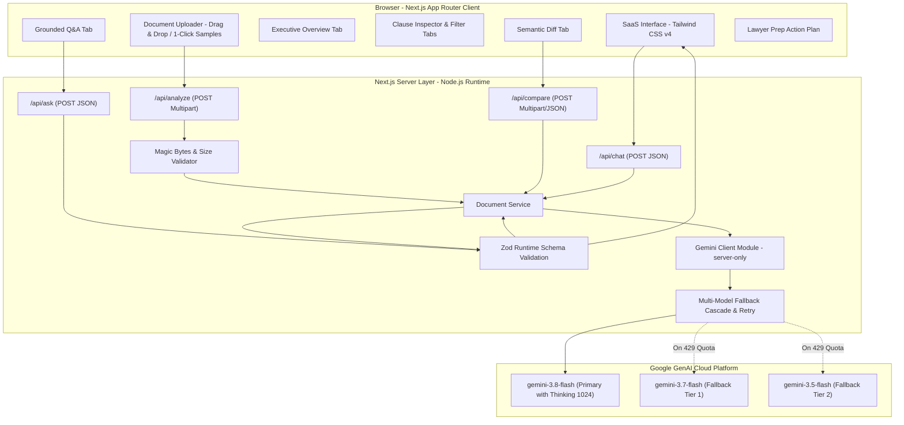

# ClauseWise AI — Legal Document Navigator

> **Tagline:** Understand the document before you sign it.  
> **Status:** PromptWars Hackathon Project  
> **Author:** Sayan Modak

---

> [!IMPORTANT]
> **Responsible Legal AI Notice:**  
> **ClauseWise provides informational assistance and document interpretation, not professional legal advice.**  
> It does not provide legal representation, formulate binding legal strategies, or declare clauses legally enforceable or invalid. Consult a licensed attorney for professional legal counsel.

---

## Table of Contents
- [Problem](#problem)
- [Solution](#solution)
- [Key Features](#key-features)
- [How GenAI Is Used](#how-genai-is-used)
- [Grounded Q&A](#grounded-qa)
- [Smart Document Comparison](#smart-document-comparison)
- [Responsible AI / Legal Limitations](#responsible-ai--legal-limitations)
- [Architecture](#architecture)
- [Tech Stack](#tech-stack)
- [Local Setup](#local-setup)
- [Environment Variables](#environment-variables)
- [Demo Workflow](#demo-workflow)
- [Screenshots & Visual Evidence](#screenshots--visual-evidence)
- [Deployment](#deployment)
- [Author](#author)

---

## Problem

Legal contracts—such as employment agreements, consulting engagements, non-disclosure agreements (NDAs), vendor terms, and master service agreements (MSAs)—are intentionally dense, adversarial, and saturated with legalese.

- **Asymmetry of Information:** Non-lawyers and busy professionals routinely sign contracts without fully comprehending notice periods, uncapped liability, intellectual property surrender, or post-termination non-compete covenants.
- **Cost Barrier:** Independent legal counsel costs anywhere from $400 to $1,000+ per hour, pricing out contractors, small businesses, startup employees, and freelancers.
- **Human Oversight:** Critical terms, such as automatic renewal traps, unilateral amendment rights, or missing dispute expense terms, are frequently missed in 10+ page agreements.

---

## Solution

**ClauseWise AI** bridges the gap between raw legal text and human comprehension. It acts as an intelligent, document-grounded navigational assistant that non-lawyers can use to inspect agreements before signing.

ClauseWise ingests legal PDF or TXT documents, parses them server-side, and produces:
1. **Executive Plain-Language Overview:** Document at a glance, identified parties, key dates, financial terms, and high-level risk assessment.
2. **Clause Inspector:** Standardized attention badges (`INFORMATIONAL`, `IMPORTANT`, `REVIEW`) paired with exact source quotes and plain-English explanations.
3. **Document-Grounded Q&A:** Interactive inquiry interface strictly bound to the contract, featuring automated absence verification when terms are missing.
4. **Smart Version Comparison:** Semantic contract diff engine identifying material shifts in rights, compensation, obligations, and restrictions across versions.
5. **Action Plan / Lawyer Preparation:** Actionable pre-signature checklist and targeted questions to bring to legal counsel.

---

## Key Features

- **Multi-Format Ingestion (PDF & TXT):** Server-side validation supporting documents up to 10MB, with binary magic-byte (`%PDF-`) inspection to reject disguised payloads.
- **Categorized Clause Extraction:** Automatically maps clauses into 9 standard legal categories (*Termination, Payment & Fees, Intellectual Property, Liability & Indemnification, Confidentiality, Non-Compete & Restrictive Covenants, Governing Law & Dispute Resolution, Warranties, General*).
- **Standardized Attention Badges:**
  - `INFORMATIONAL` (Blue): Administrative clauses, definitions, standard terms.
  - `IMPORTANT` (Amber): Core payment obligations, IP transfer, essential commitments.
  - `REVIEW` (Red/Rose): Unilateral rights, non-competes, aggressive penalties, short cure windows.
- **Strict Grounding & Absence Verification:** Zero hallucinated obligations; if a term is absent, ClauseWise explicitly returns: *"This information is not specified in the provided document."*
- **1-Click Preloaded Demonstrations:** Ready-to-test fictional agreements for rapid hackathon evaluation without requiring manual file uploads.
- **Zero Database Architecture:** All document processing is stateless and ephemeral, ensuring user privacy and rapid performance.
- **Fully Responsive SaaS Interface:** Clean, accessible legal-tech aesthetic built with Tailwind CSS v4, supporting both desktop and mobile viewports (`390px`+).

---

## How GenAI Is Used

ClauseWise AI uses the official Google GenAI SDK (`@google/genai`) to interface with Google's advanced Gemini models:

- **Primary Model:** `gemini-3.8-flash`
- **Fallback Cascade:** Resilient multi-tier fallback to `gemini-3.7-flash` and `gemini-3.5-flash` with exponential backoff to handle transient API limits during live hackathon demonstrations.
- **Thinking Budget:** Configured with `thinkingConfig: { thinkingBudget: 1024 }` to perform deliberate multi-step legal reasoning before synthesizing structured summaries.
- **Structured JSON Output:** Native `responseSchema` integration with runtime Zod schema parsing ensures reliable, type-safe responses without regex markdown stripping fragility.
- **Native Document Processing:** Direct multi-modal document transmission via Gemini Files API for PDFs and text block attachments for plain text files.

---

## Grounded Q&A

The **Ask Document** feature provides interactive exploration strictly grounded in the document context:

1. **Source Grounding:** Every answer must cite the specific section or clause title (e.g., `Section 3` or `Clause 6.2`).
2. **Supporting Verbatim Quote:** Generates an exact excerpt from the source text alongside the plain-English explanation.
3. **Absence Verification (Edge-Case Handling):** When asked about terms not defined in the contract (e.g., *"Who pays the arbitration fees?"* in a contract that omits fee allocation), ClauseWise returns:
   - Status: `NOT_SPECIFIED`
   - Answer: `"This information is not specified in the provided document."`
   - Source / Quote: `null`
4. **Context Retention:** Maintains multi-turn conversation memory within the active browser session.

---

## Smart Document Comparison

Unlike naive character- or word-level diff tools that flag trivial formatting changes, ClauseWise AI semantically compares two contracts:

- **Material Shifts Isolated:** Detects changes to financial compensation, notice period durations, non-compete restrictions, liability caps, and dispute resolution mechanisms.
- **Before & After Structured Cards:** Side-by-side display of the baseline text and revised clause text.
- **"Why This May Matter":** Clear, actionable explanation of the operational or legal impact of the revision.
- **Attention Rating:** Prioritizes changes with `REVIEW`, `IMPORTANT`, or `INFORMATIONAL` badges.

---

## Responsible AI / Legal Limitations

ClauseWise AI is engineered around strict Responsible Legal AI Guardrails:

- **No Legality Declarations:** ClauseWise NEVER states that a clause is "legal", "illegal", "valid", "invalid", "enforceable", or "unenforceable".
- **No Substitute for Counsel:** Every view presents visible disclaimers clarifying that the tool provides informational interpretation only.
- **Exact Numeric Fidelity:** Currency symbols, compensation numbers, percentages, day counts, and deadlines are preserved verbatim from the source contract.
- **Privacy & Retention Transparency:** Users are informed that document bytes are transmitted to Google Gemini for real-time analysis and may be temporarily retained by Google Cloud APIs; ClauseWise operates zero persistent document databases.
- **Server-Side Secret Hygiene:** `GEMINI_API_KEY` is restricted strictly to server-side execution (`src/server/`) and is never exposed to the client bundle.

---

## Architecture

ClauseWise AI follows a clean, serverless Next.js architecture with zero external database dependencies:



---

## Tech Stack

| Layer | Technology | Rationale |
| :--- | :--- | :--- |
| **Framework** | Next.js 16 (App Router) | High-performance React 19 server/client architecture with built-in route handlers. |
| **Language** | TypeScript 5 | Strict end-to-end type safety across schemas, API payloads, and components. |
| **Styling** | Tailwind CSS v4 | High-performance, clean SaaS styling without heavy component library overhead. |
| **GenAI SDK** | `@google/genai` (v2.22.0) | Official Google GenAI SDK with native support for Gemini 3.8/3.7/3.5 models and thinking budgets. |
| **Validation** | Zod (v4) | Runtime schema validation for API inputs and structured Gemini JSON responses. |
| **Icons** | Lucide React | Crisp, accessible iconography. |
| **Storage / DB** | Stateless (Zero Database) | Ephemeral processing ensures zero credential, document, or state leakages. |

---

## Local Setup

### Prerequisites
- Node.js 18.18+ or Node.js 20+
- npm or pnpm
- Google Gemini API Key ([Get one here from Google AI Studio](https://aistudio.google.com/))

### Installation Steps

```bash
# 1. Clone the repository
git clone https://github.com/SayanModakDev/clausewise-ai.git
cd clausewise-ai

# 2. Install dependencies
npm install

# 3. Create environment configuration
cp .env.example .env.local

# 4. Add your Gemini API key to .env.local
# Example: GEMINI_API_KEY=AIzaSy...
```

### Run Locally

```bash
# Start local development server
npm run dev
```

Open [http://localhost:3000](http://localhost:3000) in your browser.

### Quality Verification Commands

```bash
# Typecheck
npx tsc --noEmit

# Lint
npm run lint

# Production Build
npm run build
```

---

## Environment Variables

| Variable | Required | Exposure | Description |
| :--- | :---: | :--- | :--- |
| `GEMINI_API_KEY` | **Yes** | **Server-Only** | Google Gemini API key used by `@google/genai` for document analysis, Q&A, and version comparison. Must **NEVER** be prefixed with `NEXT_PUBLIC_`. |

---

## Demo Workflow

Two fictional legal test fixtures are included in the repository under [`demo_fixtures/`](demo_fixtures/):

1. **Version A:** `demo_fixtures/employment_agreement_v1.txt` (or `.pdf`)
   - Novacorp Solutions & Priya Sen
   - Monthly Compensation: ₹40,000
   - Termination Notice: 30 days
   - Post-Termination Non-Compete: 3 months
   - Arbitration: Binding in Bangalore (**Arbitration fees intentionally unspecified**)
2. **Version B:** `demo_fixtures/employment_agreement_v2.txt` (or `.pdf`)
   - Monthly Compensation: ₹45,000 (+₹5,000)
   - Termination Notice: 60 days (+30 days)
   - Post-Termination Non-Compete: 6 months (+3 months)
   - Arbitration: Binding in Bangalore (**Arbitration fees remain unspecified**)

### Reproducible Evaluation Steps:
1. **Analyze Version A:** Click **"Employment Agreement (v1)"** on the landing page, then click **"Analyze Document"**.
2. **Inspect Overview:** Verify identified parties (*Novacorp Solutions*, *Priya Sen*), compensation (*₹40,000*), and key dates.
3. **Inspect Clauses:** View categorized clauses; notice Section 3 (*Term & Termination*) and Section 5 (*Non-compete*) flagged with `REVIEW` badges.
4. **Test Grounded Q&A:** In the **Ask** tab, submit:  
   `"Can I terminate this agreement immediately?"`  
   *Result:* Answers that 30 days written notice is required, and immediate exit is reserved only for cause/gross misconduct.
5. **Test Absence Verification:** In the **Ask** tab, click **"Who pays the arbitration fees?"**  
   *Result:* Returns `NOT_SPECIFIED`: *"This information is not specified in the provided document."*
6. **Compare Versions:** In the **Compare** tab, click **"Run Live Comparison (v1 vs v2)"**.  
   *Result:* Automatically isolates all three material changes (compensation, notice period, non-compete duration).
7. **Inspect Action Plan:** View the pre-signature checklist and targeted questions to ask an attorney.
8. **Reset Application:** Click **"New Analysis"** in the top header to reset to the clean landing state.

*(See [DEMO_TESTING.md](DEMO_TESTING.md) for the detailed step-by-step evaluator testing checklist).*

---

## Screenshots & Visual Evidence

| View | Description |
| :--- | :--- |
| **Landing State & Disclaimers** | Upload zone, drag-and-drop support, prominent responsible legal AI notices, and 1-click sample demo buttons. |
| **Executive Overview** | Plain-language executive summary, identified parties, vital dates, financial terms, and high-level risk profile. |
| **Clause Inspector** | Categorized clause breakdowns with verbatim quotes, plain explanations, and standardized badges (`INFORMATIONAL`, `IMPORTANT`, `REVIEW`). |
| **Document Grounded Q&A** | Query response citing Section 3 with verbatim supporting quotation and source grounding notice. |
| **Absence Verification Guardrail** | Explicit `NOT SPECIFIED IN DOCUMENT` state verifying zero hallucinated terms when fees are omitted. |
| **Smart Semantic Comparison** | Detected 3 material contract changes with side-by-side Before/After cards and "Why This May Matter" insights. |
| **Action Plan / Lawyer Prep** | Structured pre-signature obligations roadmap, ambiguities checklist, and questions for counsel. |
| **Mobile Responsiveness** | Seamless reflow at `390px × 844px` with zero horizontal overflow or clipping. |

---

## Deployment

ClauseWise AI is optimized for single-command deployment on **Vercel**:

1. Push your repository to GitHub:
   ```bash
   git push origin main
   ```
2. Import the project into [Vercel](https://vercel.com).
3. Set the Environment Variable:
   - `GEMINI_API_KEY`: `<Your Gemini API Key>`
4. Deploy. Next.js App Router route handlers will automatically run on Vercel Serverless Functions.

---

## Author

**Sayan Modak**  
- GitHub: [@SayanModakDev](https://github.com/SayanModakDev)  
- Project: ClauseWise AI — PromptWars Hackathon
